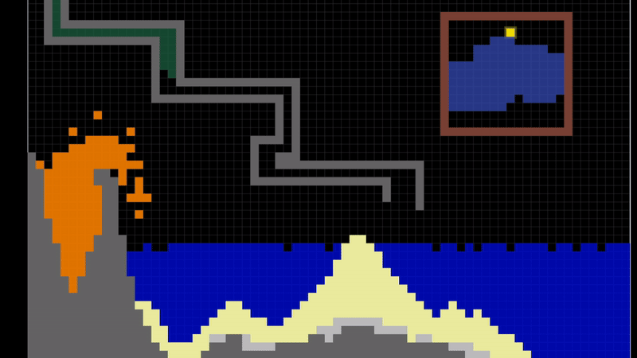
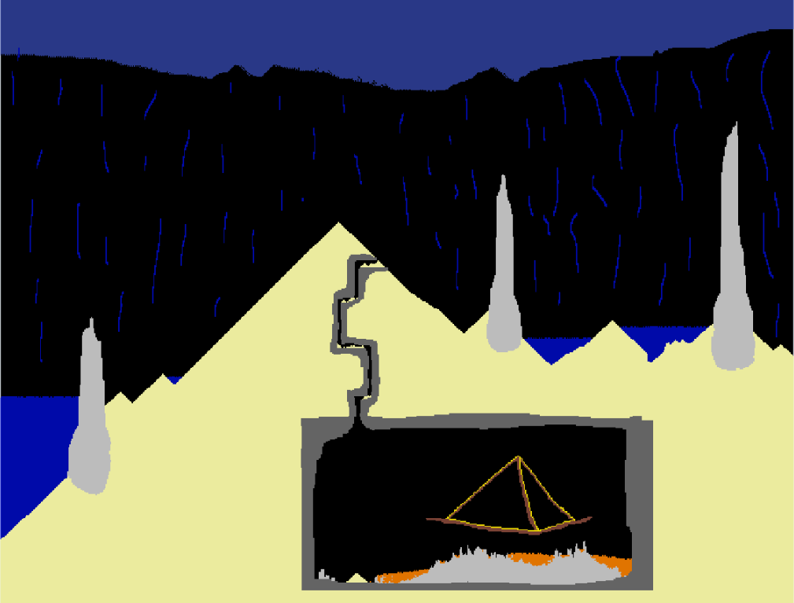

# LCB Powder Simulator
**<u>LCB Powder Simulator</u> is a efficient, fully native JS powder simulation that runs on the [Canvas 2d API](https://developer.mozilla.org/en-US/docs/Web/API/Canvas_API) and [CDEJS](https://github.com/Louis-CharlesBiron/canvasDotEffect).**

# Table of Contents
- **[Web Interface](#web-interface) ([direct link here](https://louis-charlesbiron.github.io/LCB_Powder_Sim))**

- **[Other deployements: App / NPM](#other-deployements)**
- **[Documentation](#documentation)**
    - **[Simulation Class](#simulation-class)**
    - [MapGrid Class](#mapgrid-class)
    - **[Simulation API](#simulation-api)**
    - [Materials](#materials)
    - [Brushes](#brushes)
    - [Saves](#saves)
- [Visual Examples](#visual-examples)
- [Credits](#credits)

# [Web Interface](#table-of-contents)
A quick and simple Web page to test out the simulation without installing anything!

Link: [https://louis-charlesbiron.github.io/LCB_Powder_Sim](https://louis-charlesbiron.github.io/LCB_Powder_Sim)

# [Other deployements](#table-of-contents)

## Applications:

### **Desktop App**:
### - Download Instructions
- Coming soon!

### - Info
- Toggleable transparent app background for cool effect :) 
- Allows for a fullscreen experience
- More accessible UI (because bigger)
- Runs on [NeutralinoJS](https://github.com/neutralinojs/neutralinojs)

----

### **Chrome Extension**:
### - Download Instructions
- Coming soon!

### - Info
- A Nice little distraction in the top right of your browser
- More compact UI

## Modules / Packages:

For those who know how to code a bit and want have more control over the simulation, here are the **NPM** and **native browser build** releases as well as [Documentation](#documentation) bellow!

### **NPM**:
- Coming soon!
### **Broswer Build**:
- Coming soon!
 
# [Documentation](#table-of-contents)
This section explains what are the available functions and types to control certain aspect of the simulation.

## [Simulation Class](#table-of-contents)
The `Simulation` class is the core of the simulation and manages all rendering and world manipulation (except for physics).
#### **The Simulation constructor takes the following parameters:**
###### - `new Simulation(CVS, readyCB?, autoStart?, usesWebWorkers?, userSettings?, colorSettings?)`
- **CVS** -> A [CDEJS `Canvas`](https://github.com/Louis-CharlesBiron/canvasDotEffect?tab=readme-ov-file#canvas) instance.
- **readyCB**? -> A callback ran once the simulation is started. `(simulation)=>{}`
- **autoStart**? -> Whether the simulation automatically starts once instanciated. (Defaults to true)
- **usesWebWorkers**? -> Whether the physics calculations are offloaded to a worker thread. (RECOMMENDED) (Defaults to true)
- **userSettings**? -> An object defining the user settings. (Defaults to `DEFAULT_USER_SETTINGS`)
- **colorSettings**? -> An object defining the color settings. (Defaults to `DEFAULT_COLOR_SETTINGS`)

#### **Noteworthy attributes**
- `pixels` -> The array containing all materials (might not be directly available when using workers)
- `backStepSavingMaxCount` -> The amount of back step saved (defaults to `DEFAULT_BACK_STEP_SAVING_COUNT`)
- `isMouseWithinSimulation` -> Whether the mouse is inside the simulation bounding box
- `isRunning` -> Whether the simulation is currently running
- `selectedMaterial` -> The material used by default for world manipulation (defaults to `MATERIALS.SAND`)
- `brushType` -> The shape used to draw materials on the simulation with mouse (defaults to `BRUSH_TYPES.PIXEL`)
- `sidePriority` -> The side prioritised first by the physics (defaults to `SIDE_PRIORITIES.RANDOM`)
- `loopExtra` -> A callback called on each rendered frame (defaults to `null`)
- `stepExtra` -> A callback called on each physics step (defaults to `null`)

**UserSettings**:
- `dragAndZoomCanvasEnabled` -> Whether the user can use left click to move around and wheel to zoom (Defaults to true)
- `warningsDisabled` -> Hides warning messages from console (Defaults to false)
- `showBorder` -> If true, displays the bounding box of the simulation (Defaults to true)
- `showGrid` -> If true, displays a grid over the simulation to delimit pixels (Defaults to true)
- `smoothDrawingEnabled` -> Whether to fill gaps between mouse event for smoother drawing (Defaults to true)
- `visualEffectsEnabled` -> Whether to display some visual effect (Defaults to true) [MAYBE AFFECT PERFORMANCE]

**ColorSettings**:
This object allows the color customization of the grid and materials.
- `grid`, `border` -> The color of the grid and border of the map. `[r,g,b,a]`
- `AIR`, `SAND`, `WATER`, **...** -> The color of each material. (*The key must be in UPPERCASE*) `[r,g,b,a]`

## [MapGrid Class](#table-of-contents)
The `MapGrid` class **is mostly used internally** to handle the simulation world space / dimensions.

It still provides informative world functions such as `getLocalMapPixel`, `getAdjacency`, `indexToMapPos`, `mapPosToIndex` as well as the mapWidth / mapHeight in both local and global pixels.
 
# [Simulation API](#table-of-contents)

### **The simulation programming interface**
This section will go over pretty much all available functions to control the simulation.

## - Simulation setup
- `readyCB` -> A callback ran once the simulation is started. `(simulation)=>{}`
(Defined in the Simulation's constructor)

This can be used to update map properties / import a world as soon as the simulation is started.

## - Simulation configurations
#### - `updateMapSize(width?, height?)` -> Updates the map dimensions.
- `width` The new width of the map (local px)
- `height` The new height of the map (local px)
#### - `updateMapPixelSize(pixelSize?)` -> Updates the map pixel size. (Defaults to `MapGrid.DEFAULT_PIXEL_SIZE`)
- `pixelSize` The new map pixel size (global px)

#### - `updateSidePriority(sidePriority)` -> Updates the side prioritised first by the physics.
- `sidePriority` The new side priority. One of `SIDE_PRIORITIES`. (Defaults to `SIDE_PRIORITIES.RANDOM`)

#### - `updatePhysicsUnitType` -> Updates whether the physics calculations are offloaded to a worker thread.
- `usesWebWorkers` Whether an other thread is used. (Defaults to `true`)

## - Simulation Control
#### - `start(force?)` -> Sets the state of the simulation to be running.
- `force` If true, forces the start even if simulation is already running.
#### - `stop()` -> Sets the state of the simulation to be stopped.
#### - `step()` -> Runs and displays one physics step.
#### - `backstep()` -> Displays the previous physics step saved. (*Does not actually run physics backwards*)

## - User Control
#### - `updateSelectedMaterial(material)` -> Updates the material used by default for world manipulations.
- `material` The materials to select. One of `MATERIALS`
#### - `updateBrushType(brushType)` -> Updates the shape used to draw materials on the simulation with mouse.
- `brushType` The brush type to use -> One of `BRUSH_TYPES` 
#### - `updateColors(colorSettings)` -> Updates the colors used for the grid and/or the materials.
- `colorSettings` The colors to update

## - World Interation
#### - `placePixel(mapPos, material?)` (*Similarly `placePixelAtCoords`, `placePixelAtIndex`*) -> Places a pixel on the map.
- `mapPos` The map position of the pixel (`[x,y]`)
- `material` The material used, one of `MATERIALS`. (Defaults to the selected material)
#### - `placePixelsWithBrush(x, y, brushType?)` -> Places pixels at the specified coordinates, according to the provided brush pattern.
- `x` The X value of the center positions
- `y` The Y value of the center positions
- `brushType` The brush type used, one of `BRUSH_TYPES`. (Defaults to the current brush type)
     
#### - `clear()` -> Fills the simulation with air
#### - `fill(material?)` -> Fills the entire simulation with a specific material.
- `material` The material used, one of `MATERIALS`. (Defaults to the selected material)
#### - `fillArea(pos1, pos2, material)` -> Fills the specified area of the map with a specific material.
- `pos1` The top-left pos of the area (`[leftX, topY]`)
- `pos2` The bottom-right pos of the area (`[rightX, bottomY]`)
- `material` The material used, one of `MATERIALS`. (Defaults to the selected material)

## - Persistence
#### - `load(mapData, useSaveSizes)` -> Fills the map with saved data.
- `mapData` The save data. (`String`, `Uint16Array`, `Object`)
    - Either **a string in the format given by the function `exportAsText()`**
    - *Or a `Uint16Array` containing the material value for each index*
    - *Or an `Object` containing the material value for each index `{"index": material}`*
- `useSaveSizes?` Whether to resize the map size and pixel size to the save's values
     
#### - `exportAsText(disableCompacting?, callback?)` -> Exports the simulation map as text.
- `disableCompacting` Whether to disable the text compacting (*not recommended for large maps*) (Defaults to `false`)
- `callback` If using web workers, use this callback to retrieve the return value `(stringValue)=>{...}`

## - Others
#### - `getPixelAtMapPos(mapPos)` -> Returns the material at the provided local pos.
- `mapPos` The map pos (`[x,y]`)
#### - `updateImgMapFromPixels(force?)` -> Updates the display image map according to the pixels array (Basically, **renders a frame**)
- `force` If true, disables optimization and forces every pixel to get redrawn (*mostly used internally*)

 
# [Materials](#table-of-contents)
There are multiple material enums available each describing different properties:

### - Materials types (`MATERIALS`)
- `AIR` -> Represents an empty pixel.
- `SAND` -> Falls in air and liquids, forms pile of itself.
- `WATER` -> Falls in air, spreads horizonally once grounded.
- `STONE` -> A solid block that stands still, and doesn't interact.
- `GRAVEL` -> Falls in air in liquids, but doesn't form pile of itself.
- `INVERTED_WATER` -> Water, but with inverted gravity.
- `CONTAMINANT` -> Acts like water, but spreads in other liquids.
- `LAVA` -> Acts like water, but slowed down. Transforms into stone when in contact with liquids. Slowly melts away some other materials.
- `ELECTRICITY` -> TODO. Can interact with some materials.
- `COPPER` -> Similar to stone, but can get lit by electricity.
### - Material groups (`MATERIAL_GROUPS`)
- `TRANSPIERCEABLE` -> A group of materials some other can fall through. (*AIR, WATER, INVERTED_WATER, CONTAMINANT*)
- `LIQUIDS` -> A group of liquids. (*WATER, INVERTED_WATER, CONTAMINANT*)
- `CONTAMINABLE` -> A group of materials that can be contaminated. (*WATER, INVERTED_WATER*)
- `MELTABLE` -> A group of materials that can be melted. (*SAND, GRAVEL*)

### - Material states (`MATERIAL_STATES`)
- `EMPTY` -> No states
- `COPPER`:
    - `LIT` -> Represents lit copper
    - `ORIGIN` -> Represents lit copper in direct contact with electricity 
    - `DISABLED` -> Represents unlit copper

# [Brushes](#table-of-contents)

All brushes available are given in the `BRUSH_TYPES` enum:
- `PIXEL` -> Draws a single pixel.
- `VERTICAL_CROSS` -> Draws pixels in a `+` symbol.
- `LINE3` ->  Draws pixels in a `|` symbol.
- `ROW3` -> Draws pixels in a `-` symbol.
- `BIG_DOT` -> Draws pixels in a fat dot symbol.
- `X3` -> Draws pixels in a 3x3 square.
- `X5` -> Draws pixels in a 5x5 square.
- `X15` -> Draws pixels in a 15x15 square.
- `X25` -> Draws pixels in a 25x25 square.
- `X55` -> Draws pixels in a 55x55 square.
- `X99` -> Draws pixels in a 99x99 square.

 
# [Visual Examples](#table-of-contents)

### Create your own isolated interactive worlds!

## [Credits](#table-of-contents)

Made by [Louis-Charles Biron](https://github.com/Louis-CharlesBiron) !

Every line of code in this repository was written by hand with passion!